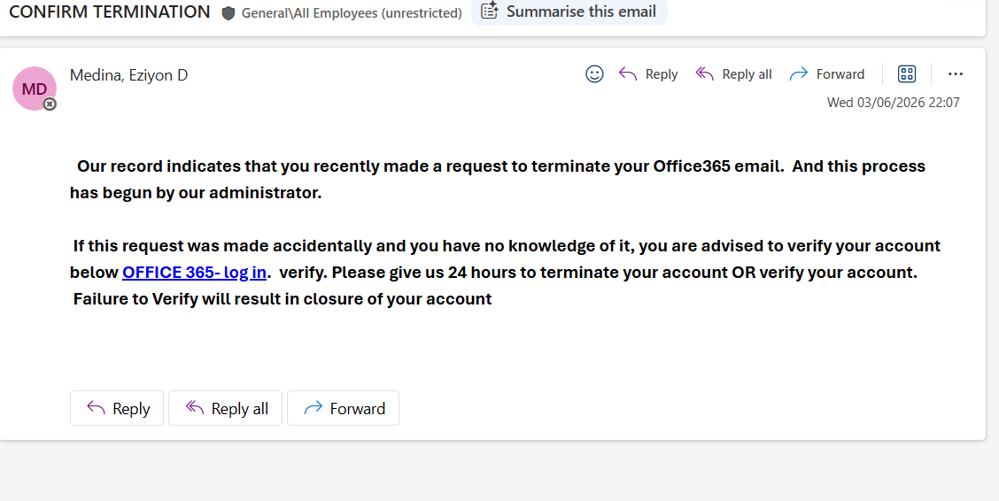
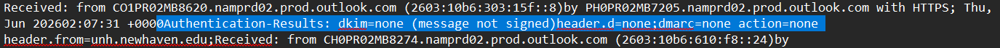
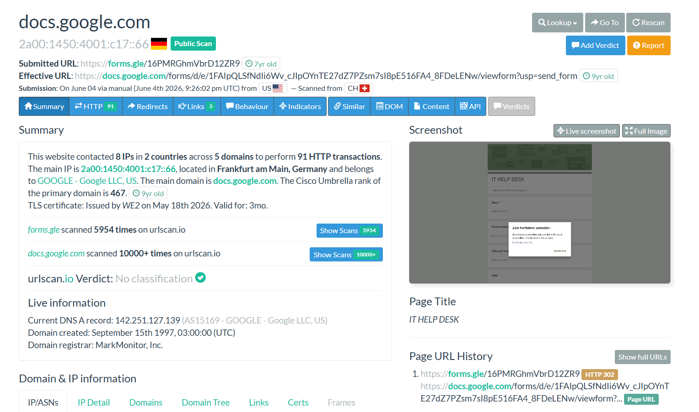
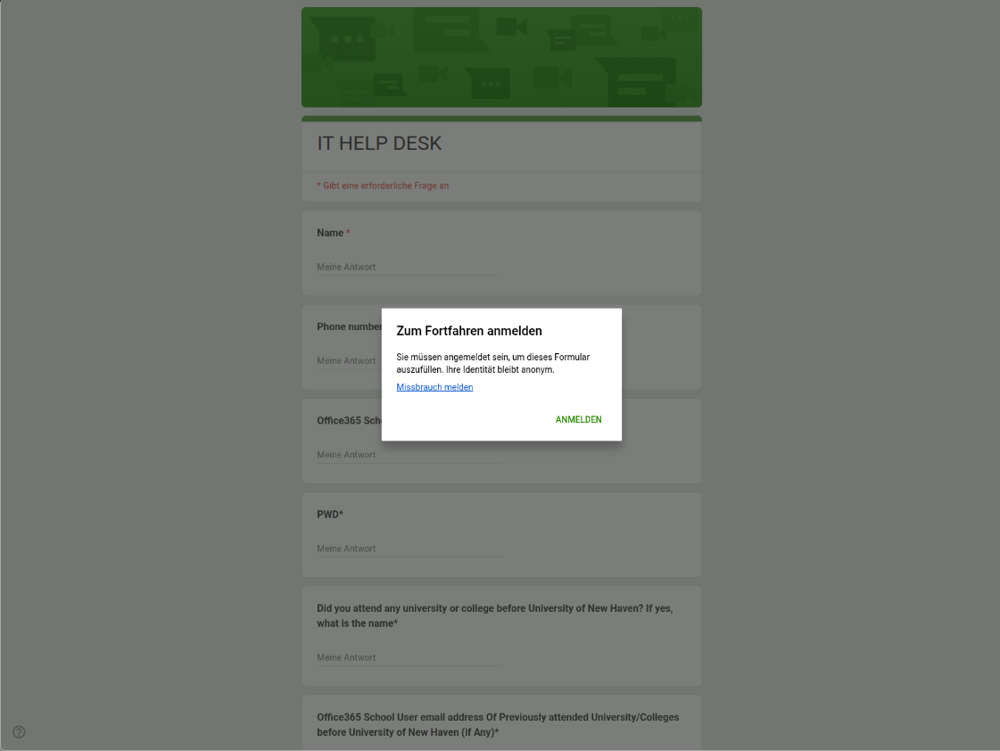
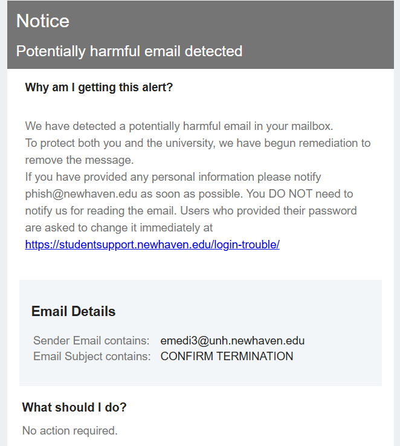

# phishing-email-investigation
# Office 365 Credential Harvesting Phishing Investigation


## Executive Summary

This project documents the investigation of a credential harvesting phishing campaign targeting Microsoft Office 365 users.

The phishing email used an account termination theme to create urgency and trick recipients into verifying their accounts. Investigation revealed that the embedded hyperlink redirected users to a Google Forms page impersonating an IT Help Desk portal. The form requested Office 365 credentials and additional personal information, indicating a credential harvesting and information gathering campaign.

The incident was later confirmed as malicious by the University of New Haven Information Technology Department, which removed the email from affected mailboxes and initiated remediation actions.

---

## Key Technical Finding

Email header analysis revealed the following Exchange authentication headers:

- X-MS-Exchange-Organization-AuthAs: Internal
- X-MS-Exchange-CrossTenant-AuthAs: Internal

These headers indicate the message originated from an authenticated internal Microsoft 365 account rather than an external sender.

Combined with the phishing content and credential harvesting behavior, this suggests the sender account may have been compromised and subsequently used to distribute phishing emails.

This finding is significant because internally authenticated phishing emails can bypass traditional perimeter email security controls and are generally perceived as more trustworthy by recipients, increasing the likelihood of successful credential theft.

---

## Incident Overview

| Category | Details |
|-----------|-----------|
| Subject | CONFIRM TERMINATION |
| Threat Type | Credential Harvesting |
| Severity | High |
| Delivery Method | Email |
| Target Platform | Microsoft Office 365 |
| Date Observed | June 2026 |

---

## Investigation Objectives

- Analyze the phishing email
- Review email authentication indicators
- Investigate embedded URLs
- Analyze the destination landing page
- Identify Indicators of Compromise (IOCs)
- Determine attacker objectives
- Map activity to MITRE ATT&CK
- Document findings and remediation recommendations

---

# Investigation Methodology

## 1. Email Analysis

The phishing email claimed that the recipient's Office 365 account required verification to avoid account termination.

### Phishing Indicators Identified

- Fear and urgency-based language
- Threat of account closure
- Request for account verification
- Generic messaging
- Suspicious hyperlink
- IT support impersonation

### Evidence



---

## 2. Email Header Analysis

Authentication review identified missing email security controls.

### Authentication Results

| Control | Result |
|----------|----------|
| DKIM | None |
| DMARC | None |

### Exchange Authentication Headers

- X-MS-Exchange-Organization-AuthAs: Internal
- X-MS-Exchange-CrossTenant-AuthAs: Internal

The presence of these headers suggests the email originated from an authenticated internal Microsoft 365 account.

### Evidence



---

## 3. URL Analysis

### Embedded URL

```text
hxxps://forms[.]gle/16PMRGhmVbrD12ZR9
```

### Expanded URL

```text
hxxps://docs[.]google[.]com/forms/d/e/1FAIpQLSfNdIi6Wv_cJIpOYnTE27dZ7PZsm7sI8pE516FA4_8FDeLENw/viewform
```

### URLScan Findings

- Hosted on Google infrastructure
- Valid TLS certificate
- Legitimate domain reputation
- No infrastructure-based indicators of compromise

Although hosted on a trusted platform, the destination page was being abused to collect credentials.

### Evidence



---

## 4. Landing Page Analysis

The destination page impersonated an IT Help Desk portal and requested Office 365 credentials.

### Credential Collection Fields

- Office365 School Email
- Password (PWD)

### Additional Data Collection

- Name
- Phone Number
- Previous University/College Attended
- Previous University Email Address

A significant finding was the mismatch between the Office 365 verification theme and the Google Forms destination.

This discrepancy is a common phishing indicator and strongly suggests malicious intent.

### Evidence



---

# Indicators of Compromise (IOCs)

## Email Indicators

| Indicator | Value |
|------------|---------|
| Subject | CONFIRM TERMINATION |
| Sender Email | e@unh.newhaven.edu |
| Display Name | Medina, Eziyon D |

## URL Indicators

```text
hxxps://forms[.]gle/16PMRGhmVbrD12ZR9
```

```text
hxxps://docs[.]google[.]com/forms/d/e/1FAIpQLSfNdIi6Wv_cJIpOYnTE27dZ7PZsm7sI8pE516FA4_8FDeLENw/viewform
```

## Domain Indicators

```text
forms[.]gle
docs[.]google[.]com
```

## Credential Collection Indicators

- Office365 School Email
- Password (PWD)

---

# Social Engineering Techniques Observed

- Account termination threat
- Urgency-based messaging
- Office 365 verification lure
- IT support impersonation
- Credential harvesting
- Abuse of trusted cloud services

---

# MITRE ATT&CK Mapping

## Credential Access

| Technique ID | Technique |
|-------------|-----------|
| T1566.001 | Spearphishing Link |

### Potential Adversary Objectives

- Credential Harvesting
- Information Gathering
- Account Compromise

---

# Analyst Assessment

The phishing campaign leveraged a legitimate cloud-hosted service (Google Forms) to increase trust and evade reputation-based detections.

The presence of internal Exchange authentication headers suggests the email may have been distributed from a compromised Microsoft 365 account, increasing credibility and potentially bypassing perimeter filtering controls.

The primary objective of the campaign was credential harvesting, with secondary objectives including collection of personal information and potential account takeover.

Based on the collected evidence and organizational remediation actions, this activity is assessed with high confidence as a credential harvesting phishing campaign.

---

# Organizational Validation

The University of New Haven Information Technology Department later identified the message as malicious and removed it from affected user mailboxes.

### Evidence



---

# Remediation Actions

1. Remove phishing emails from affected mailboxes.
2. Reset passwords for affected users.
3. Revoke active sessions.
4. Investigate sender account activity.
5. Review authentication logs.
6. Monitor or block identified phishing URLs.
7. Conduct user awareness training.

---

# Lessons Learned

- Trusted domains do not guarantee trusted content.
- Google Forms can be abused for phishing campaigns.
- Credential harvesting attacks frequently leverage legitimate cloud services.
- Internal accounts may be abused if compromised.
- URL expansion and landing page analysis are critical investigation steps.

---

# Tools Used

- Microsoft 365 Email Analysis
- Exchange Header Analysis
- URLScan.io
- Google Forms Investigation
- MITRE ATT&CK Framework
- Manual IOC Extraction

---

# Skills Demonstrated

- Phishing Analysis
- Email Header Analysis
- Threat Hunting
- IOC Extraction
- URL Investigation
- Threat Intelligence Analysis
- Incident Response
- Security Documentation
- MITRE ATT&CK Mapping

---

# Full Report

[View Full Investigation Report](Phishing%20Email%20Case%20Study.pdf)

---

# Author

**Vamshi Ramavath**

Cybersecurity Analyst | SOC Analyst Candidate

GitHub: https://github.com/rvamsh98

